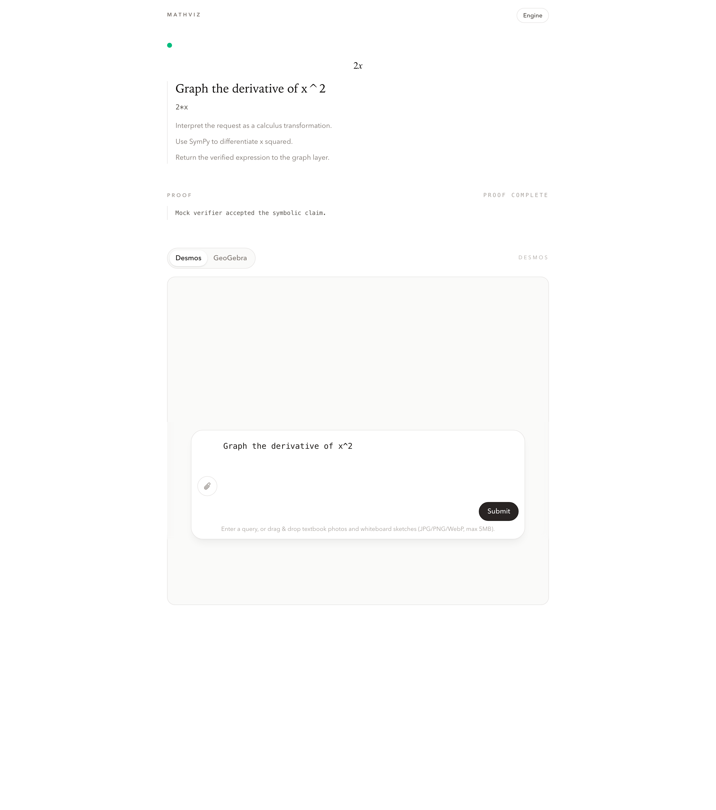
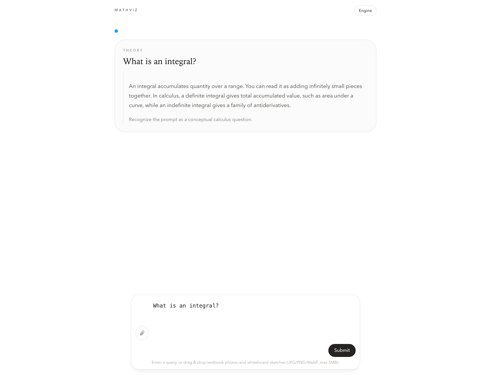

# MathViz

Verified-first math orchestration built with Phoenix LiveView, SymPy, KaTeX, and graph hooks.

MathViz is a math canvas that treats symbolic work and conceptual questions differently:

- computation prompts go through routing, SymPy, verification, and graph building
- theory prompts return a text answer and skip the symbolic pipeline entirely

The core product rule is simple: do not render graph layers until verification passes.

## Screenshots

| Verified solve | Theory response |
| --- | --- |
|  |  |

## Why This Exists

Most AI math demos go straight from prompt to prose. MathViz does not.

It routes input into a strict contract, executes symbolic work through SymPy, gates graph output behind a verifier boundary, and keeps a headless API and LiveView UI on the same pipeline. When a prompt is conceptual instead of computational, it answers in chat mode instead of forcing nonsense through a graphing path.

## How It Works

### Computation flow

`LiveView / API / CLI -> Solve -> Pipeline -> NlpRouter -> SymPyWorker -> Verifier -> GraphBuilder`

### Theory flow

`LiveView / API / CLI -> Solve -> Pipeline -> NlpRouter -> chat response`

### Main pieces

- `MathViz.Pipeline.run/2` is the shared orchestration entrypoint
- `MathViz.Solve.run/2` is the validated headless service used by web, API, and CLI
- `MathViz.Contracts` validates AI, SymPy, and graph boundary payloads
- `MathViz.Morphisms.NlpRouter.Stub` provides deterministic local routing
- `MathViz.Morphisms.NlpRouter.Nim` uses NVIDIA NIM through an OpenAI-compatible endpoint
- `MathViz.Engines.SymPyWorker` runs symbolic execution through a long-lived Python Port
- `MathViz.Morphisms.Verifier.Mock` hard-gates graph rendering behind a verifier boundary
- `MathViz.Morphisms.GraphBuilder.Default` produces Desmos and GeoGebra payloads from verified symbolic state

## What Ships Today

- Phoenix 1.8 LiveView UI with a sparse bottom-docked command bar
- Native LiveView image uploads with drag-and-drop and shared 5MB validation
- `Cmd/Ctrl+Enter` submit support with newline-preserving textarea behavior
- KaTeX rendering for symbolic output
- Lazy-loaded Desmos and GeoGebra hooks
- Headless `POST /api/solve` endpoint for JSON and multipart clients
- CLI entrypoint via `mix math.prove "..."` using the same pipeline
- Theory/computation mode split in the response contract
- Strict development-mode surfacing for NIM routing failures instead of silent stub fallback
- ExUnit, Playwright, and Cypress smoke coverage for the main shipped flows
- `mix qa.report` harness with Markdown, JSON, and tool-call-graph artifacts under `tmp/qa/latest`

## Stack

- Backend: Elixir `~> 1.15`, Phoenix `1.8.4`, Phoenix LiveView `~> 1.1.0`, Bandit
- Validation and integration: Ecto embedded schemas, `Req`, `Jason`
- Symbolic engine: Python + SymPy over a supervised Port
- Frontend: server-rendered LiveView, plain JS hooks, Tailwind CSS v4, KaTeX
- Browser automation: Playwright and Cypress
- QA harness: `mix qa.report`, file-based artifacts, internal pipeline call graph
- Optional dev shell: Nix via `flake.nix`

## Quick Start

### Prerequisites

- Elixir / Erlang
- Bun
- Python 3
- Chromium-compatible tooling for Playwright
- Optional: `nix develop`

### Install

```bash
mix setup
```

`mix setup` creates `.venv`, installs `requirements.txt`, installs JS dependencies, and builds assets.

### Environment

Create `.env.local` from `.env.example`.

```bash
cp .env.example .env.local
```

Supported variables:

- `MATH_VIZ_NLP_MODE=stub|nim|dual`
- `NVIDIA_NIM_API_KEY`
- `NIM_API_KEY` (legacy alias for local compatibility)
- `NVIDIA_NIM_BASE_URL`
- `NVIDIA_NIM_MODEL`
- `NVIDIA_NIM_TIMEOUT_MS`
- `DESMOS_API_KEY`

Routing behavior:

- `stub`: always use deterministic local routing
- `nim`: always use NVIDIA NIM and fail if the key is missing
- `dual`: try NVIDIA NIM first, then fall back to the stub router

If `MATH_VIZ_NLP_MODE` is unset, the app auto-selects `dual` when either `NVIDIA_NIM_API_KEY` or legacy `NIM_API_KEY` is present.

In development, NIM routing failures are surfaced directly in the UI instead of silently swapping to the stub router. In test and production, the existing fallback behavior remains available unless overridden.

## Run

### Web

```bash
mix phx.server
```

Open `http://localhost:4000`.

### CLI

```bash
mix math.prove "Graph the derivative of x^2"
mix math.prove "What is an integral?"
mix qa.report --scope smoke --browser all
```

### Headless API

Text solve:

```bash
curl -sS -X POST http://127.0.0.1:4000/api/solve \
  -H 'content-type: application/json' \
  -d '{"query":"Graph the derivative of x^2"}'
```

Theory solve:

```bash
curl -sS -X POST http://127.0.0.1:4000/api/solve \
  -H 'content-type: application/json' \
  -d '{"query":"What is an integral?"}'
```

Multipart image solve:

```bash
curl -sS -X POST http://127.0.0.1:4000/api/solve \
  -F 'query=' \
  -F 'image=@/absolute/path/to/whiteboard.png;type=image/png'
```

Base64 image solve:

```bash
curl -sS -X POST http://127.0.0.1:4000/api/solve \
  -H 'content-type: application/json' \
  -d '{"query":"Solve the equation in the image","image_mime":"image/png","image_base64":"<BASE64_HERE>"}'
```

## API Response Shape

`POST /api/solve` returns one normalized payload with:

- `mode`: `computation` or `chat`
- request metadata
- adapter used
- `chat_reply` and `chat_steps` for theory prompts
- symbolic output, proof state, and graph payloads for computation prompts
- timings

## Smoke Prompts

- `Graph the derivative of x^2`
- `What is an integral?`
- `Find the Laplace transform of e^(2x) sin(x)`
- `Solve the first-order ODE y' + 3y = 6`
- `Expand the Fourier series of x on [-pi, pi]`
- `Given the uploaded whiteboard image, transcribe the equation and solve for the derivative`

## Testing

Run the full local verification pass:

```bash
mix precommit
```

Run the unified QA harness:

```bash
mix qa.report --scope smoke --browser all
```

The harness writes:

- `tmp/qa/latest/report.md`
- `tmp/qa/latest/summary.json`
- `tmp/qa/latest/tool_call_graph.json`
- per-lane raw logs under `tmp/qa/latest/raw/`

Run browser tests directly:

```bash
bun run playwright:install
bun run cypress:install
bun run test:e2e:playwright
bun run test:e2e:cypress
```

## Repo Notes

- `PROGRESS.md` tracks implementation checkpoints
- `flake.nix` provides a reproducible shell for Elixir, Bun, Python, SymPy, and `elan`
- the verifier is intentionally mocked today; Lean integration is still future work
- vision ingest is wired through LiveView uploads and the headless API, but persistence and export flows are not in this version
